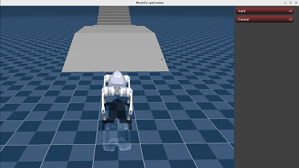
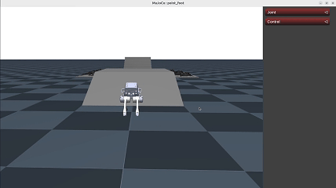
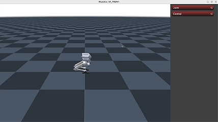
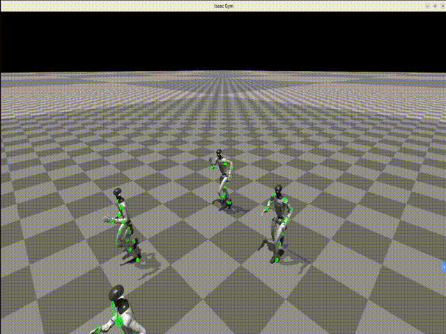
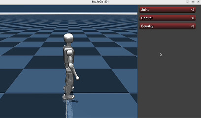

# LeggedGym-Ex


基于 [legged_gym](https://github.com/leggedrobotics/legged_gym) 的机器人训练框架，支持在 [Genesis](https://github.com/Genesis-Embodied-AI/Genesis/tree/main)、[IsaacGym](https://developer.nvidia.com/isaac-gym) 和 [IsaacSim](https://developer.nvidia.com/isaac/sim) 中进行足式机器人训练。

## 特性

- **完全基于 [legged_gym](https://github.com/leggedrobotics/legged_gym)**

  本框架保留了 legged_gym 的大部分 API 和约定，具有良好的可读性，并能更好地控制训练流程。

- **集成多种仿真器**
  
  我们支持在三种仿真器中进行训练：IsaacGym、Genesis 和 IsaacSim。
  
  选择仿真器的快速指南：
  
  - 训练速度快但渲染效果较差 -> IsaacGym
  - 兼具训练速度和流体、软体材料支持 -> Genesis 
  - 以训练速度换取更真实的渲染效果 -> IsaacSim

- **集成多种已发表论文中的 RL 方法**
  
  | 方法 | 论文链接 | 代码 |
  |------|--------|------|
  | Periodic Gait Reward | [Sim-to-Real Learning of All Common Bipedal Gaits via Periodic Reward Composition](https://arxiv.org/abs/2011.01387) | [go2_wtw](https://github.com/lupinjia/LeggedGym-Ex/blob/main/legged_gym/envs/go2/go2_wtw/go2_wtw.py#L322) |
  | Walk These Ways | [Walk These Ways: Tuning Robot Control for Generalization with Multiplicity of Behavior](https://gmargo11.github.io/walk-these-ways/) | [go2_wtw](https://github.com/lupinjia/LeggedGym-Ex/blob/main/legged_gym/envs/go2/go2_wtw) |
  | System Identification | [Learning Agile Bipedal Motions on a Quadrupedal Robot](https://arxiv.org/abs/2311.05818) | [go2_sysid](https://github.com/lupinjia/LeggedGym-Ex/tree/main/legged_gym/envs/go2/go2_sysid) |
  | Teacher-Student | [Rapid Locomotion via Reinforcement Learning](https://agility.csail.mit.edu/) | [go2_ts](https://github.com/lupinjia/LeggedGym-Ex/tree/main/legged_gym/envs/go2/go2_ts) |
  | Explicit Estimator | [Concurrent Training of a Control Policy and a State Estimator for Dynamic and Robust Legged Locomotion](https://arxiv.org/abs/2202.05481) | [go2_ee](https://github.com/lupinjia/LeggedGym-Ex/tree/main/legged_gym/envs/go2/go2_ee) |
  | Constraints as Terminations | [CaT: Constraints as Terminations for Legged Locomotion Reinforcement Learning](https://constraints-as-terminations.github.io/) | [go2_cat](https://github.com/lupinjia/LeggedGym-Ex/tree/main/legged_gym/envs/go2/go2_cat) |
  | DreamWaQ | [DreamWaQ: Learning Robust Quadrupedal Locomotion With Implicit Terrain Imagination via Deep Reinforcement Learning](https://arxiv.org/abs/2301.10602) | [go2_dreamwaq](https://github.com/lupinjia/LeggedGym-Ex/tree/main/legged_gym/envs/go2/go2_dreamwaq) |
  | SPO (Simple Policy Optimization) | [Simple Policy Optimization](https://github.com/MyRepositories-hub/Simple-Policy-Optimization) | [`legged_robot_config.py`](https://github.com/lupinjia/LeggedGym-Ex/tree/main/legged_gym/envs/base/legged_robot_config.py) |
  | CTS (Concurrent Teacher Student) | [CTS: Concurrent Teacher-Student Reinforcement Learning for Legged Locomotion](https://clearlab-sustech.github.io/concurrentTS/) | [go2_cts](https://github.com/lupinjia/LeggedGym-Ex/tree/main/legged_gym/envs/go2/go2_cts) |
  | DeepMimic | [DeepMimic: Example-Guided Deep Reinforcement Learning of Physics-Based Character Skills](https://arxiv.org/abs/1804.02717) | [g1_deepmimic](https://github.com/lupinjia/LeggedGym-Ex/tree/main/legged_gym/envs/g1/g1_deepmimic) |
  | AMP (Adversarial Motion Priors) | [AMP: Adversarial Motion Priors for Stylized Physics-Based Character Control](https://arxiv.org/abs/2104.02180) | [k1_amp](https://github.com/lupinjia/LeggedGym-Ex/tree/main/legged_gym/envs/k1/k1_amp) |

## 展示

| 机器人 | 仿真 | 实物 |
  |---|---|---|
| Unitree Go2 |  | [video](https://www.bilibili.com/video/BV1FPedzZEdi/) |
| TRON1_PF |  | [video](https://www.bilibili.com/video/BV1MdePzcEvk/) |
| TRON1_SF |  | |
| Unitree G1 DeepMimic |  | |
| Booster K1 |  | [video](https://www.bilibili.com/video/BV1GyXgBmEa9/) |

## 致谢

- [Genesis](https://github.com/Genesis-Embodied-AI/Genesis/tree/main)
- [Genesis-backflip](https://github.com/ziyanx02/Genesis-backflip)
- [legged_gym](https://github.com/leggedrobotics/legged_gym)
- [rsl_rl](https://github.com/leggedrobotics/rsl_rl)
- [unitree_rl_gym](https://github.com/unitreerobotics/unitree_rl_gym)
- [tron1-rl-isaacgym](https://github.com/limxdynamics/tron1-rl-isaacgym)
- [isaaclab](https://github.com/isaac-sim/IsaacLab)

## 待办事项

- [x] Add support for TRON1_SF (2026/02/13)
- [x] Add support for IsaacSim simulator (2026/02/15)
- [x] Add support for DeepMimic Implementation (2026/02/28)
- [x] Add support for Booster K1 Robot (2026/03/18)
- [x] Add support for AMP Implementation (2026/03/28)
- [ ] Add support for warp-based depth camera
- [ ] Add support for TRON1_WF

## 联系方式

您可以加入我们的飞书群以获取最新更新或提问：


---

```{toctree}
:maxdepth: 1
:hidden:

user_guide/index
developer_guide/index
```
